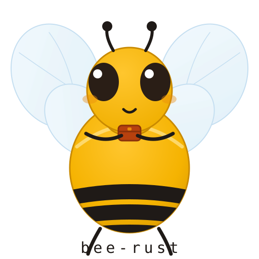

<!-- Copyright (c) 2026 erik <erik@erik.xyz> — https://erik.xyz -->
# Beerust

[简体中文](../README.md) · [English](README.en.md) · [한국어](README.ko.md) · [Русский](README.ru.md) · [Deutsch](README.de.md) · [Français](README.fr.md) · [Español](README.es.md) · [Português](README.pt.md) · [हिन्दी](README.hi.md) · [العربية](README.ar.md) · [বাংলা](README.bn.md) · [Bahasa Indonesia](README.id.md) · [日本語](README.ja.md)

Beerust es un framework web de nivel producción escrito en Rust, cuya filosofía de diseño proviene del framework Beego de Go, reexpresada con los traits, las macros y el sistema de tipos idiomáticos de Rust.

## La mascota del proyecto: Rusty



### Ficha del personaje

**Nombre**: Rusty (Xiu Xiu) — el color oxidado de Rust y, también, esa mancha de óxido que lleva pegada en el mono de trabajo.

**Aspecto**: una abeja ingeniera peluda. El vello corto de ámbar dorado cubre su abdomen regordete, con tres franjas de negro carbón como unos tirantes de trabajo torcidos; cuatro alas transparentes, tan finas que dejan pasar la luz, que al flotar zumban dejando una estela; los ojos compuestos son dos esferas de obsidiana como canicas de vidrio, cada una con su destello; con las patas delanteras abraza una caja de herramientas de color naranja oxidado, reluciente por el uso: su cesta de polen, que nunca lleva polen, sino dependencias.

**Personalidad**: adicta al trabajo, optimista y ligeramente perfeccionista.

- Al reparar la colmena revisa celda por celda con las antenas, tan puntillosa como quien ejecuta un linter
- Las dependencias de su cesta de polen están bloqueadas con versiones fijadas a cal y canto; ay de quien las toque
- Cuando persigue un bug se queda suspendida en el aire, con las alas tan rápidas que solo se ve un anillo de estela
- El día que publica una nueva versión, baila el baile del ocho de las abejas en la entrada de la colmena

### Especificaciones visuales

| Elemento | Especificación |
|------|------|
| Cuerpo | Ámbar dorado `#F5B301`, vello abdominal corto y denso, con un halo de brillo en el borde |
| Franjas | Negro carbón `#1F1A17`, tres, solo en el abdomen |
| Alas | Azul claro translúcido `#CFE8F5`, 40 % de opacidad, con las venas dibujadas |
| Ojos compuestos | Marrón negruzco `#2A1E16`, elípticos, con un destello en la esquina superior izquierda |
| Acentos | Naranja oxidado `#B7410E` (caja de herramientas, pajarita); el color óxido es su firma |

### Conjunto de expresiones

| Expresión | Imagen | Cuándo |
|------|------|---------|
| Llena de energía | `(^o^)` pelaje erizado, alas vibrando a alta frecuencia | cuando todos los tests están en verde |
| Flotando en depuración | `o(°▽°)o` suspendida en el aire, solo se ve la estela de las alas | persiguiendo un bug difícil |
| Vuelta con la carga | `(≧▽≦)` la caja de herramientas repleta, volando con bandazos | cuando un nuevo driver se integra con éxito |
| Cabeceando | `(-_-)zZ` agazapada en la entrada de la colmena, con las antenas caídas | cuando no hay tráfico a altas horas de la noche |
| En alerta | `(#°益°)` aguijón en alto | cuando el filtro de seguridad intercepta un ataque |

### Movimientos característicos

1. **Depuración en suspensión** — cuando encuentra un bug, se cierne sobre el código, las alas zumban hasta quedar en estela y se queda mirando fijamente hasta que terminas de corregirlo.
2. **El baile del ocho** — cada vez que publica una nueva versión, da una vuelta completa alrededor de la colmena anunciando a todo el panal: «las flores han florecido». Las abejas reales usan este baile para transmitir la ubicación de las flores; Rusty lo usa para transmitir el changelog.
3. **Acicalarse** — se limpia las antenas con las patas delanteras una y otra vez. Crees que es por estética; en realidad está comprobando si la configuración se ha recargado en caliente.

### Dónde aparece

- **Logo**: de frente y en suspensión, con las alas desplegadas en un círculo que enmarca el nombre.
- **Página 404**: flotando sobre un campo de flores vacío, dando vueltas desorientada — «¿y la miel?»
- **CLI**: una pequeña abeja en el banner de arranque; cuando corres los tests se queda agachada a un lado, supervisando.
- **Anuncios de lanzamiento**: la foto del baile del ocho.

## Objetivos de diseño

| Objetivo | Métrica |
|------|------|
| **Experiencia de desarrollo** | Desde `bee-rust new` hasta la primera petición en < 30 s |
| **Rendimiento** | Sobrecarga de la capa de controladores < 5 % (frente a axum puro), latencia de ruteo P99 < 100 µs |
| **Velocidad de compilación** | Compilación completa del meta-crate < 60 s (release), compilación incremental < 5 s |
| **Tamaño del binario** | Aplicación mínima (solo router) < 5 MB (strip + LTO) |
| **Seguridad** | 0 código `unsafe` en la lógica de negocio; todo el FFI encapsulado en crates `*-sys` independientes |
| **Compatibilidad** | MSRV Rust 1.80+, siguiendo la rama stable |

## Principios de diseño

1. **Filosofía de Beego, expresión en Rust** — MVC, namespaces y cadena de filtros implementados con traits + macros
2. **Mejora progresiva** — el núcleo mínimo solo depende de axum + tokio; todo lo demás va detrás de feature flags
3. **Explícito antes que implícito** — el registro de rutas, el mapeo de modelos y el orden de los middlewares se declaran explícitamente en código
4. **Abstracciones de costo cero** — despacho estático con traits y macros expandidas en tiempo de compilación, sin sobrecarga de funciones virtuales
5. **Independencia de los motores de almacenamiento** — el trait de cada motor puede sustituirse por otra implementación sin afectar a la lógica de negocio de las capas superiores
6. **Observabilidad integrada** — instrumentación de tracing y métricas en todo el framework; logs estructurados activados por defecto

## Diseño de la arquitectura

### Topología de crates

```
bee_rust/           # Meta-crate, re-export + feature flags
bee_router/         # Enrutado + controlador + Context + cadena de filtros
bee_orm/            # ORM — trait Model + QuerySet + Migration + mapeo de relaciones
bee_kv/             # Abstracción unificada KV/Cache — Redis + Memcached
bee_search/         # Motor de búsqueda/análisis — Elasticsearch + OpenSearch + ClickHouse
bee_graph/          # Base de datos de grafos — Neo4j + NebulaGraph + ArangoDB
bee_tsdb/           # Base de datos de series temporales — InfluxDB + Apache IoTDB + QuestDB
bee_config/         # Gestión de configuración — INI/YAML/ENV + recarga en caliente
bee_cache/          # Abstracción de caché — Memory/Redis/Memcache
bee_session/        # Sesión — backends Memory/Redis/Cookie/Database
bee_logs/           # Registros — logs multinivel + integración con tracing
bee_template/       # Renderizado de plantillas — basado en tera
bee_cli/            # CLI — andamiaje/generación de código/ejecución en desarrollo/empaquetado (migración en planificación)
```

### Diagrama de arquitectura

```
                          ┌───────────────────────┐
                          │  bee_rust  (meta)      │
                          │  re-export + features  │
                          └───────────┬───────────┘
                                      │
              ┌───────────────────────┼───────────────────────┐
              │                       │                       │
     ┌────────▼────────┐    ┌────────▼────────┐    ┌────────▼────────┐
     │    Web Layer     │    │   Data Layer    │    │   Tool Layer    │
     └────────┬────────┘    └────────┬────────┘    └────────┬────────┘
              │                       │                       │
  ┌───────────┼───────────┐  ┌───────┼───────┐  ┌───────────┼───────────┐
  │ bee_router            │  │ bee_orm        │  │ bee_cli               │
  │  - route register     │  │  - Model/Query  │  │  - scaffolding        │
  │  - controller trait   │  │  - Migration   │  │  - hot reload          │
  │  - filter chain       │  │  - Connection   │  │  - code generation    │
  │  - param extract      │  │                 │  │                       │
  ├────────────────────────┤  ├────────────────┤  ├───────────────────────┤
  │ bee_template           │  │ bee_config     │  │ bee_logs              │
  │  - template render     │  │  - INI/YAML/ENV│  │  - multi-level log    │
  │  - HTML/JSON           │  │  - hot reload   │  │  - tracing integrate  │
  ├────────────────────────┤  ├────────────────┤  └───────────────────────┘
  │ bee_session            │  │ bee_cache      │
  │  - session management  │  │  - cache trait  │
  │  - multi-backend       │  │  - Mem/Redis    │
  └────────────────────────┘  └────────────────┘

  ┌─────────────────────────────────────────────────────────┐
  │                   Storage Engine Layer                   │
  ├──────────────────┬──────────────────────────────────────┤
  │ bee_kv           │  Redis + Memcached                   │
  │ bee_search       │  Elasticsearch + OpenSearch + ClickHouse │
  │ bee_graph        │  Neo4j + NebulaGraph + ArangoDB      │
  │ bee_tsdb         │  InfluxDB + Apache IoTDB + QuestDB   │
  └──────────────────┴──────────────────────────────────────┘
```

### Dependencias entre crates

```
bee_config (sin dependencias)
bee_logs   (sin dependencias)
bee_cache  → bee_config
bee_kv     → bee_config
bee_session → bee_cache, bee_config
bee_template (sin dependencias)
bee_orm    → bee_config, bee_cache
bee_search → bee_config
bee_graph  → bee_config
bee_tsdb   → bee_config
bee_router → bee_session, bee_template, bee_config, bee_logs
bee_cli    → bee_router, bee_orm
bee_rust   → todos los crates anteriores (re-export)
```

### Bases de datos compatibles

| Categoría | Base de datos | Crate correspondiente | Feature Flag |
|------|--------|-----------|-------------|
| **Relacional** | SQLite | `bee_orm` | `sqlite` |
| | PostgreSQL | `bee_orm` | `postgres` |
| | MySQL | `bee_orm` | `mysql` |
| | TiDB | `bee_orm` | `mysql` |
| **KV / caché** | Redis | `bee_kv` / `bee_cache` | `redis` |
| | Memcached | `bee_kv` / `bee_cache` | `memcache` |
| **Búsqueda / análisis** | Elasticsearch | `bee_search` | `elasticsearch` |
| | OpenSearch | `bee_search` | `opensearch` |
| | ClickHouse | `bee_search` | `clickhouse` |
| **Base de datos de grafos** | Neo4j | `bee_graph` | `neo4j` |
| | NebulaGraph | `bee_graph` | `nebulagraph` |
| | ArangoDB | `bee_graph` | `arangodb` |
| **Series temporales** | InfluxDB | `bee_tsdb` | `influxdb` |
| | Apache IoTDB | `bee_tsdb` | `iotdb` |
| | QuestDB | `bee_tsdb` | `questdb` |

### Cadena de filtros de peticiones

```
Petición → [SecurityFilter detección de ataques] → [restauración de Session] → [validación de parámetros] → [hook prepare] → [procesado handle] → [hook finish] → Respuesta
                  ↓ cualquier etapa puede interrumpirse (similar al Abort de Beego)
```

## Funcionalidades

A continuación tienes un resumen de las funcionalidades; el uso detallado de cada módulo, los ejemplos de código y la documentación de la API están en la [Referencia de la API](api.es.md).

### Núcleo web (bee_router)

Controladores MVC: el trait `Controller` + `Context`, con soporte para namespaces de rutas, registro de métodos RESTful y cadenas de filtros de peticiones.

- Salida de respuestas: `ctx.json()` / `ctx.text()` / `ctx.html()`
- Redirección / interrupción: `ctx.redirect()` / `ctx.abort()`
- Sesión y parámetros: `ctx.session` / `ctx.params`

### Detección de seguridad (feature `security`)

Un filtro de detección de ataques basado en [security-rust](https://crates.io/crates/security-rust) que cubre 27 tipos de ataques, como XSS, inyección SQL, inyección de comandos y SSRF; se activa con una sola línea:

```rust
let security = SecurityFilter::new();  // Los 27 detectores activados
```

### ORM (bee_orm)

La macro derivada `#[derive(Model)]` + consultas encadenadas de QuerySet (filter / order_by / limit), con soporte para SQLite, PostgreSQL, MySQL y TiDB.

### Gestión de configuración (bee_config)

La macro derivada `#[derive(Config)]`, con soporte para cargar INI / YAML / ENV y recarga en caliente.

### Motores de almacenamiento

KV / caché (Redis + Memcached), motores de búsqueda (Elasticsearch / OpenSearch / ClickHouse), bases de datos de grafos (Neo4j / NebulaGraph / ArangoDB) y bases de datos de series temporales (InfluxDB / IoTDB / QuestDB) comparten una abstracción unificada por trait; los drivers se compilan según los feature flags.

### Sesión, registros y plantillas

- Sesión: múltiples backends Memory / Redis / Cookie / Database
- Registros: logs multinivel + integración con tracing
- Plantillas: renderizado basado en tera

### Herramientas CLI

```bash
bee-rust new my-app            # Crea el andamiaje del proyecto
bee-rust generate controller user
bee-rust run --watch           # Ejecución en desarrollo (recarga en caliente)
bee-rust pack                  # Empaquetado y despliegue
```

## Pasos de uso

### Requisitos del entorno

- Rust 1.80+
- Cargo

### Instalación

```bash
# Clona el proyecto
git clone https://github.com/erikwang2013/bee-rust.git
cd bee-rust

# Compila
cargo build --workspace

# Ejecuta los tests
cargo test --workspace
```

### Inicio rápido

```bash
# Crea un nuevo proyecto con la CLI
cargo run -p bee_cli -- new hello
cd hello

# Ejecuta el servidor de desarrollo
cargo run
```

### Usar en tu proyecto

```toml
[dependencies]
bee_rust = { git = "https://github.com/erikwang2013/bee-rust", features = ["full"] }
```

## Notas técnicas

### Stack tecnológico

| Capa | Tecnología |
|----|------|
| Base HTTP | axum 0.8 + tower 0.5 |
| Runtime asíncrono | tokio 1.x |
| Serialización | serde + serde_json |
| Motor de plantillas | tera 1.x |
| Capa de logs | tracing + tracing-subscriber |
| CLI | clap 4 |
| Parseo de configuración | toml / serde_yaml / INI propio |
| Manejo de errores | thiserror |
| Macros procedurales | syn + quote + proc-macro2 |

### Patrones de diseño

| Patrón | Aplicación |
|------|------|
| **Builder** | Logger, Router, QuerySet |
| **Abstracción por trait** | Cache, KvStore, SearchEngine, GraphDB, TimeSeriesDB |
| **Macros derivadas** | `#[derive(Model)]`, `#[derive(Config)]` |
| **Feature gates** | Implementaciones de drivers compiladas bajo demanda (redis, memcached, elasticsearch, etc.) |
| **Cadena de filtros** | Cadena de filtros de peticiones, a la altura del Filter de Beego |

### Listado de crates

| Crate | Función | Equivalente en Beego |
|-------|------|-----------|
| `bee_rust` | Meta-crate, punto de entrada unificado | — |
| `bee_router` | Enrutado + controlador + Context + filtros | `server/web`, `context` |
| `bee_orm` | ORM + QuerySet + Migration | `client/orm` |
| `bee_kv` | Abstracción unificada KV/Cache | `client/cache` (extensión) |
| `bee_search` | Motor de búsqueda/análisis | — (nuevo) |
| `bee_graph` | Base de datos de grafos | — (nuevo) |
| `bee_tsdb` | Base de datos de series temporales | — (nuevo) |
| `bee_config` | Gestión de configuración + recarga en caliente | `client/config` |
| `bee_cache` | Abstracción de caché | `client/cache` |
| `bee_session` | Gestión de sesiones | `server/web/session` |
| `bee_logs` | Registros | `logs` |
| `bee_template` | Renderizado de plantillas | — (mejorado) |
| `bee_cli` | Herramientas CLI | herramienta `bee` |

### Cobertura de tests

Los 68 tests del repositorio pasan:

| Crate | N.º de tests |
|-------|--------|
| bee_config | 4 |
| bee_cache | 4 |
| bee_template | 2 |
| bee_logs | 3 |
| bee_kv | 4 |
| bee_search | 6 |
| bee_graph | 5 |
| bee_tsdb | 5 |
| bee_orm | 7 |
| bee_session | 2 |
| bee_router | 9 |
| bee_cli | 16 |

## Apoya el proyecto

Si este proyecto te resulta útil, ¡escanea el código QR para hacer una donación y apoyarlo! Gracias.

**WeChat Pay**


**Alipay**


**Transferencias internacionales (Bank Transfer)**

Los usuarios en el extranjero pueden apoyar el proyecto mediante transferencia bancaria:

**Información del beneficiario**

| Campo | Valor |
|------|------|
| Nombre del beneficiario | WANG KEXUN |
| Número de cuenta del beneficiario | 881015918251 |

**Banco receptor**

| Campo | Valor |
|------|------|
| SWIFT Code | AABLHKHHXXX |
| Nombre del banco | ZA Bank Limited |
| Código del banco | 387 |
| Dirección del banco | Core F, Cyberport 3, 100 Cyberport Road, Hong Kong |

**Banco intermediario para transferencias transfronterizas (si es necesario)**

> Nota: esta es la información del banco intermediario (banco corresponsal) para transferencias transfronterizas, no la del banco receptor. Consulta a tu banco emisor si es necesario proporcionarla.

- **Para transferencias en dólares de Hong Kong, yuanes y dólares estadounidenses** (banco intermediario: Citibank):

| Campo | Valor |
|------|------|
| Nombre del banco | Citibank N.A. Hong Kong |
| SWIFT Code | CITIHKHXXXX |
| Código del banco | 006 |
| Nombre de la sucursal | Hong Kong Branch |
| Código de la sucursal | 391 |
| Dirección del banco | Citibank Tower, Citibank Plaza, 3 Garden Road, Central, Hong Kong |

- **Para transferencias en otras divisas** (banco intermediario: BNY Mellon):

| Campo | Valor |
|------|------|
| Nombre del banco | THE BANK OF NEW YORK MELLON |
| SWIFT Code | IRVTUS3NXXX |
| Dirección del banco | THE BANK OF NEW YORK MELLON, 240 GREENWICH STREET, NEW YORK, United States |

### Donación en criptomonedas (Crypto Donation)

Si este proyecto te resulta útil, escanea el código QR para donar, ¡gracias!

| Red (Network) | Código QR (QR Code) | Dirección de billetera (Wallet Address) |
|---|---|---|
| BNB Smart Chain (BEP20) | [](./coin/1.jpg) | `0x355d429f97511897ccb4e271ec888205f9ab6629` |
| Tron (TRC20) | [](./coin/2.jpg) | `TEdDHWLajt1XvqtPDWmQctdrJaC3pzZZzz` |
| Ethereum (ERC20) | [](./coin/3.jpg) | `0x355d429f97511897ccb4e271ec888205f9ab6629` |
| Aptos | [](./coin/4.jpg) | `0x836e3780edfc3f7b2372b39e2a1a3a5d7adfaccd96c726f21cfde1b50dd68030` |
| Plasma | [](./coin/5.jpg) | `0x355d429f97511897ccb4e271ec888205f9ab6629` |
| Polygon POS | [](./coin/6.jpg) | `0x355d429f97511897ccb4e271ec888205f9ab6629` |
| Solana | [](./coin/7.jpg) | `2hfhboHdmdrYsY25XfQSsEWxq5ip4EQsR7f4AzSRMUyr` |
| The Open Network (TON) | [](./coin/8.jpg) | `UQB9kFQohzmXUir9QSSZq01iwl9aQZIDdBpNmDklljRtCoGK` |
| Arbitrum One | [](./coin/9.jpg) | `0x355d429f97511897ccb4e271ec888205f9ab6629` |
| AVAX C-Chain | [](./coin/10.jpg) | `0x355d429f97511897ccb4e271ec888205f9ab6629` |

### Licencia

Apache-2.0
